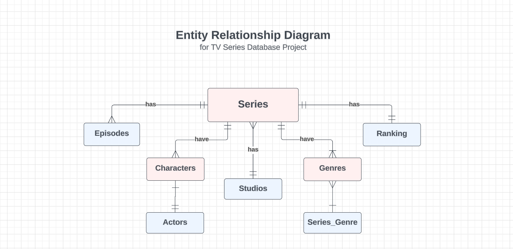

# Design.md

By:  Muhammad Zuraiz

Video overview: 
[YouTube Link, To Be Added]

## Scope

### Purpose of the Database:
The purpose of this database is to display a collection of information related to various TV series, which includes details like the series titles, characters, studios, episodes, genres, and actors.

### Included in Scope:
- Series titles
- Characters
- Studios producing the series
- Episodes of each series
- Genres of each series
- Actor who played the character

### Outside the Scope: 
- Detailed reviews or ratings for each series
- Licensing or legal information related to series copyright
- User/Account data (e.g., user preferences, watch history)

### User Capabilities:
Users should be able to:
- Browse and search for series titles
- View information about characters, studios, ranking, episodes, and actors
- Filter series by genres
- Add new data in tables (e.g., series)
- Update existing information (e.g., creator)
- Delete outdated or incorrect data entries

### Beyond Scope:
- User authentication and authorization mechanisms
- E-commerce features for purchasing anime merchandise or subscriptions

## Representation

### Entities

1. Series
   - Attributes: id, title, studio_name, release_year, creator
   - Types: VARCHAR for title and creator, INT for IDs and release_year
   - Constraints: NOT NULL for IDs, title and studio_name

2. Characters
   - Attributes: charactr_id, character_name, series_name
   - Types: VARCHAR for character_name and series_name, INTEGER for charcter_id
   - Constraints: UNIQUE for character_name

3. Studios
   - Attributes: id, studio_name
   - Types: VARCHAR for studio_name, INTEGER for IDs
   - Constraints: NOT NULL for studio_name

4. Episodes
   - Attributes: episode_id, episode_title, series_id, title, imdb_rating
   - Types: VARCHAR for episode_title, INTEGER for episode_id and series_id, BOOLEAN for imdb_rating
   - Constraints: NOT NULL for episode_id, series_id and series_name

5. Ranking
   - Attributes: series_title, earned_rating, rank
   - Types: Varchar for series_title and rank, BOOLEAN for earned_rating
   -Constraints: UNIQUE for rank

6. Genre
   - Attributes: id, genre_name
   - Types: VARCHAR for genre_name, INTEGER for IDs
   - Constraints: NOT NULL for genre_name

7. Series_Genre
   - Attributes: id, genre_name
   - Types: VARCHAR for genre_name, INTEGER for IDs
   - Constraints: NOT NULL for id, series_name and genre_name

8. Actors
   - Attributes: actor_name, character_id, charcter_name 
   - Types: VARCHAR for actor_name and character_name, INTEGER for character_id
   - Constraints: NOT NULL for actor_name and character_id

### Relationships

Relationships:
- One-to-Many relationship between Series and Episodes (One series can have multiple episodes)
- One-to-Many relationship between Series and Characters (One series can have multiple characters)
- One-to-many relationship between Characters and Actor(One character can have multiple actors)
- Many-to-Many relationship between Series and Genres (One series can belong to multiple genres and One genre can belong to multiple series, and so on)

## Limitations

- The database may not capture all possible series genres clearly
- Limited support for data, such as titles or episodes